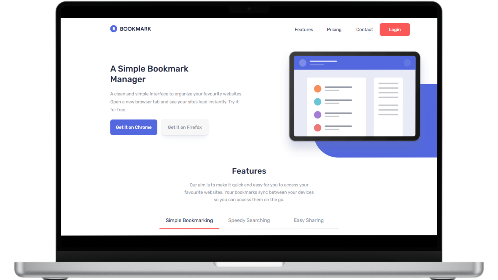

 # Bookmark

<figure>
    
</figure>

## 📝 **Sobre o Projeto**

    Bookmark é uma landing page moderna e responsiva, seguindo o conceito Mobile First para garantir compatibilidade em qualquer dispositivo. Ela inclui funcionalidades para verificação do campo de e-mail e exibição dinâmica de conteúdo nas seções Features e Frequently Asked Questions, permitindo uma interação fluida e intuitiva. O design é limpo, funcional e otimizado para desempenho.

[Demo do Projeto](https://dashboard-walacedev.netlify.app/) 

## 🛠️ **Tecnologias Utilizadas**

- **HTML5** para a estrutura do conteúdo.
- **CSS3** para estilização e design responsivo.
- **JavaScript** para funcionalidades dinâmicas.
- **Sass** (Syntactically Awesome Stylesheets) para pré-processamento de CSS.

## 🚀 **Recursos Principais**
- **Design Responsivo:** Layout flexível que oferece uma experiência consistente em qualquer dispositivo.
- **Mobile First:** Design responsivo para todos os dispositivos.
- **Verificação de E-mail:** Validação do campo de e-mail.
- **Conteúdo Dinâmico:** Exibição de informações nas seções **Features** e **Frequently Asked Questions** ao clicar nos botões correspondentes.

 

## 📂 **Estrutura do Projeto**

├── src 
│   ├── assets          # Imagens 
│   ├── css             # Arquivo de estilização 
│   ├── js              # Arquivo de JavaScript 
│   └── sass            # Arquivos de pré-processador Sass 
├── .gitattributes      # Configurações de atributos do Git 
├── LICENSE             # Licença MIT 
├── README.md           # Documentação do projeto 
└── index.html          # Arquivo principal HTML do projeto

